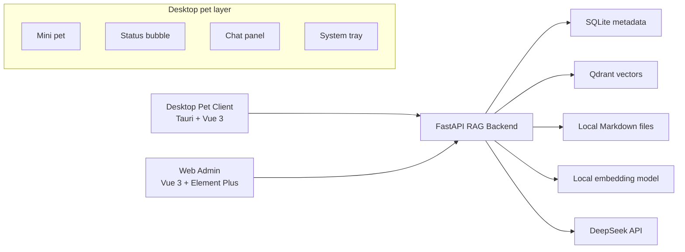
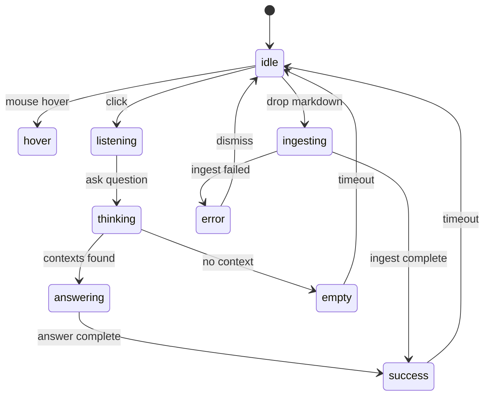

# KnowRAG 桌宠版设计方案

日期：2026-06-04

## 目标

KnowRAG 桌宠版是在原有本地 RAG 知识库系统之上，新增一个可爱陪伴型桌面入口。它不是替代 Web 管理台，而是让用户用更轻松、自然的方式完成日常知识库操作。

核心目标：

- 将本地 RAG 系统包装成一个常驻桌面的可爱知识助手。
- 用户可以通过桌宠进行快捷问答、拖拽 Markdown 入库、查看入库反馈。
- 保留 Web 管理台作为完整管理入口。
- 桌宠通过状态、表情、气泡和轻量动效提供陪伴感。
- 桌宠不承担复杂后台管理任务，避免变成笨重客户端。

产品定位：

> 一个住在桌面角落的本地知识库助手，帮用户整理 Markdown 文档，并基于用户自己的资料回答问题。

## 设计原则

- 可爱但不打扰：默认安静待机，有任务时给出轻量反馈。
- 陪伴感来自状态反馈，不依赖复杂人格系统。
- 桌宠负责日常入口，Web 管理台负责完整管理。
- RAG 核心能力仍由后端统一提供。
- 第一版优先可运行和可扩展，不追求复杂动画或 3D 形象。

## 非目标

MVP 阶段不实现：

- Live2D 或 3D 桌宠。
- 语音输入和语音播报。
- 主动读取用户文件系统。
- 多角色换装系统。
- 复杂长期记忆人格系统。
- 自动执行系统命令。
- 跨设备同步。

这些能力可以在 RAG 后端、Web 管理台和桌宠 MVP 稳定后再规划。

## 总体架构



架构边界：

- 桌宠客户端只负责桌面交互、状态展示和调用后端 API。
- Web 管理台负责知识库、文档、设置和诊断。
- FastAPI 后端负责文档入库、向量检索、DeepSeek 调用和数据持久化。
- Qdrant、SQLite、本地文件目录和模型配置不直接暴露给桌宠。

## 技术选择

### 桌宠客户端

推荐使用：

- Tauri
- Vue 3
- Vite
- Pinia
- CSS 动画或 Lottie 动画

选择理由：

- Tauri 体积较小，适合本地小工具。
- 支持透明窗口、置顶窗口、拖拽文件、系统托盘等桌宠能力。
- Vue 3 可以复用 Web 管理台的部分 UI 思路和状态管理经验。

### 后端

沿用前一份设计：

- FastAPI
- SQLite
- Qdrant
- 本地 embedding 模型
- DeepSeek API

桌宠不改变 RAG 后端的核心设计，只会新增少量适配桌宠的接口或事件返回格式。

## 桌宠形态

桌宠分为三种主要形态。

### 迷你形态

默认常驻桌面，只显示角色本体。

能力：

- 可拖动。
- 可置顶。
- 右键打开菜单。
- 点击展开问答面板。
- 拖入 `.md` 文件触发入库。
- 长时间无操作时进入安静待机状态。

### 气泡形态

用于展示短状态、任务反馈和轻量提示。

示例：

```text
我先帮你整理进去。
我去知识库里翻一下。
找到了，下面这些片段最相关。
这部分我在资料里没找到，可以先补充文档。
入库失败了，要不要重试？
```

气泡规则：

- 气泡最多显示 1 到 2 行。
- 默认数秒后自动消失。
- 错误和任务完成气泡可以保留更久。
- 气泡不展示长答案，长答案进入展开面板。

### 展开面板

点击桌宠后出现，用于正式问答和查看来源。

能力：

- 选择知识库。
- 输入问题。
- 流式展示答案。
- 展示引用来源。
- 点击引用查看原文片段。
- 打开 Web 管理台。
- 查看最近入库任务状态。

展开面板不是完整后台，只保留高频操作。

## 可爱陪伴型状态机

桌宠用状态机表达情绪和任务状态。



状态定义：

```text
idle        空闲待机
hover       鼠标靠近
listening   等待用户输入
thinking    正在检索知识库
answering   正在生成回答
ingesting   正在入库文档
success     成功完成任务
empty       资料不足
error       出错
```

每个状态包含：

- 角色图像或动画。
- 气泡文案。
- 可用操作。
- 自动恢复规则。

## 角色视觉建议

MVP 推荐使用 2D 扁平或半拟物形象，避免第一版投入过多动画工程。

建议方向：

- 小型知识精灵。
- 软萌机器人。
- 戴书签或小背包的学习助手。

视觉要求：

- 桌面上小尺寸也能看清轮廓。
- 表情变化明显。
- 支持透明背景。
- 动画可以从 4 到 8 个状态开始。
- 不使用复杂骨骼动画作为 MVP 依赖。

MVP 资源可以先用静态 PNG 或 GIF：

```text
idle.png
hover.png
thinking.gif
answering.gif
ingesting.gif
success.png
empty.png
error.png
```

后续再升级为 Lottie、Spine 或 Live2D。

## 桌宠核心功能

### 快捷问答

流程：

1. 用户点击桌宠。
2. 展开问答面板。
3. 用户选择知识库并输入问题。
4. 桌宠进入 `thinking` 状态。
5. 后端完成检索后进入 `answering` 状态。
6. 面板流式显示答案。
7. 回答结束后显示引用来源，桌宠进入 `success` 状态。

交互规则：

- 问答结果必须显示来源。
- 资料不足时不编造答案。
- DeepSeek 调用失败时显示重试入口。

### 拖拽 Markdown 入库

流程：

1. 用户将 `.md` 文件拖到桌宠上。
2. 桌宠进入 `ingesting` 状态。
3. 客户端调用后端上传接口。
4. 后端创建入库任务。
5. 桌宠通过轮询或 SSE 获取任务状态。
6. 入库完成后提示成功。
7. 失败时提示错误并提供重试。

规则：

- 只接受 `.md` 文件。
- 多文件拖拽可以排队处理。
- 桌宠只显示简要进度，详情跳转 Web 管理台。

### 系统托盘

菜单项：

```text
打开问答
打开管理台
查看服务状态
隐藏桌宠
退出
```

托盘用于保证桌宠不会妨碍用户工作。

### 后端状态检查

桌宠启动时检查：

- FastAPI 后端是否可用。
- Qdrant 是否可用。
- DeepSeek API Key 是否已配置。
- Embedding 模型是否可加载。

如果后端不可用，桌宠显示简短提示，并提供打开配置或启动说明的入口。

## 桌宠 API 需求

沿用原有 API，并增加适合桌宠的轻量接口。

### Health

```text
GET /api/health
```

响应：

```json
{
  "backend": "ok",
  "database": "ok",
  "qdrant": "ok",
  "embedding": "ok",
  "deepseek_configured": true
}
```

### Pet Summary

```text
GET /api/pet/summary
```

响应：

```json
{
  "default_knowledge_base_id": "kb_123",
  "ready_document_count": 12,
  "running_ingest_jobs": 1,
  "last_message": "最近一次入库已完成"
}
```

### Chat Stream

```text
POST /api/chat/stream
```

用于桌宠问答面板流式展示。

### Document Upload

```text
POST /api/knowledge-bases/{knowledge_base_id}/documents/upload
```

桌宠拖拽文件后调用该接口。

### Ingest Job Status

```text
GET /api/ingest/jobs/{job_id}
```

桌宠用于展示入库状态。

## 前端管理台关系

Web 管理台继续负责：

- 创建和删除知识库。
- 查看文档列表。
- 查看 chunk。
- 修改模型和检索配置。
- 处理复杂错误。
- 查看历史任务。

桌宠负责：

- 日常快捷问答。
- 拖拽 Markdown 入库。
- 简短状态反馈。
- 打开管理台。

两者共用同一个 FastAPI 后端。

## 本地运行模式

开发阶段：

```text
backend: http://localhost:8000
web admin: http://localhost:5173
desktop pet: Tauri dev window
qdrant: http://localhost:6333
```

桌宠配置：

```text
KNOWRAG_API_BASE_URL=http://localhost:8000
KNOWRAG_WEB_ADMIN_URL=http://localhost:5173
```

第一版可以要求用户手动启动后端和 Qdrant。后续再做一键启动、服务守护或安装器。

## 错误处理

### 后端不可用

桌宠状态：`error`

气泡：

```text
后端服务还没启动，我现在连不上知识库。
```

操作：

- 重试连接。
- 打开启动说明。

### API Key 未配置

桌宠状态：`error`

气泡：

```text
DeepSeek 还没配置好，先去设置里填一下吧。
```

操作：

- 打开 Web 设置页。

### 入库失败

桌宠状态：`error`

气泡：

```text
这个文档我没整理进去，可以再试一次。
```

操作：

- 重试。
- 打开任务详情。

### 检索无结果

桌宠状态：`empty`

气泡：

```text
我在资料里没找到这部分内容。
```

操作：

- 展示空引用。
- 提示用户补充文档。

## MVP 范围

第一版桌宠只做：

- Tauri 透明悬浮窗口。
- 可拖动桌宠。
- 点击展开问答面板。
- 调用后端普通问答或流式问答。
- 拖拽 `.md` 文件上传并入库。
- 展示 6 到 8 个基础状态。
- 系统托盘。
- 打开 Web 管理台。

第一版不做：

- 语音。
- Live2D。
- 复杂换装。
- 主动提醒。
- 本地服务自动安装。
- 文档全文管理。

## 实施顺序

建议先完成 RAG 后端和 Web 管理台 MVP，再做桌宠。桌宠依赖后端 API 稳定。

阶段 1：后端 RAG MVP

- 知识库 API。
- Markdown 上传。
- 入库任务。
- embedding 和 Qdrant 检索。
- DeepSeek 问答。
- 引用来源。

阶段 2：Web 管理台 MVP

- 知识库列表。
- 文档上传和列表。
- 设置页面。
- 问答页面。

阶段 3：桌宠 MVP

- Tauri 项目。
- 透明悬浮窗口。
- 桌宠状态机。
- 问答面板。
- 拖拽入库。
- 托盘菜单。

阶段 4：陪伴感增强

- 优化角色视觉。
- 增加状态动画。
- 增加更自然的短文案。
- 支持主题或角色切换。

## 验收标准

桌宠 MVP 完成时应满足：

- 桌宠可以常驻桌面并拖动。
- 点击桌宠可以打开问答面板。
- 面板可以向指定知识库提问。
- 回答能显示引用来源。
- `.md` 文件可以拖到桌宠上并触发入库。
- 入库进度和结果能在桌宠上反馈。
- 后端不可用、API Key 缺失、入库失败时有清晰提示。
- 可以通过托盘隐藏、显示或退出桌宠。
- 可以从桌宠打开 Web 管理台。

## 与前一份设计的关系

前一份 `2026-06-04-rag-frontend-backend-design.md` 是 RAG 系统基础架构设计。

本文件是在该基础上新增桌宠客户端设计。后续实现计划应以两份文档共同为准：

- 先实现 RAG 后端和 Web 管理台。
- 再实现桌宠客户端。
- 桌宠不改变后端核心 RAG 能力，只消费后端 API。

