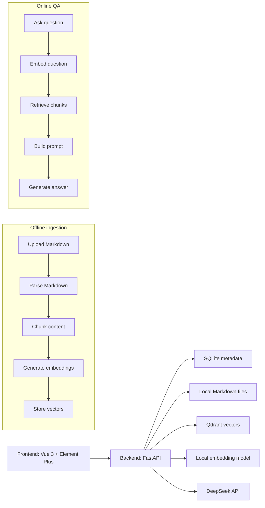

# KnowRAG 前后端分离设计方案

日期：2026-06-04

## 目标

KnowRAG 是一个本地知识库问答系统。第一阶段面向个人或小团队本地使用，主要支持 Markdown 文档，提供离线入库和在线问答两条流程。

系统目标：

- 上传或导入 Markdown 文档。
- 将文档解析、切块、向量化并写入本地向量库。
- 用户基于知识库提问，由本地 embedding 检索上下文，再调用 DeepSeek 生成答案。
- 前端展示答案、引用来源和文档入库状态。
- 保持后端服务、前端管理台、向量库和模型配置相互解耦，便于后续扩展。

## 非目标

MVP 阶段不实现以下能力：

- 多用户权限和租户隔离。
- PDF、Word、网页抓取等非 Markdown 文档格式。
- 知识图谱。
- 复杂评测平台。
- 云对象存储。
- 企业级审计和权限策略。

这些能力可以在基础 RAG 流程稳定后逐步加入。

## 推荐技术栈

### 前端

- Vue 3
- Vite
- Element Plus
- Pinia
- Vue Router
- Markdown 渲染组件

选择理由：该项目更像知识库管理台和问答工具，Vue 3 + Element Plus 能较快完成上传、表格、表单、状态展示和设置页面。

### 后端

- FastAPI
- SQLAlchemy
- SQLite
- Qdrant Python Client
- Sentence Transformers 或 FlagEmbedding
- OpenAI 兼容客户端调用 DeepSeek

选择理由：当前项目已有 FastAPI 骨架。FastAPI 适合提供清晰 API，也便于实现流式问答和后台入库任务。

### 存储和模型

- 元数据数据库：SQLite
- 向量库：Qdrant，本地运行
- 文档存储：本地 `data/documents/`
- Embedding 模型：本地 `BAAI/bge-m3`
- 生成模型：DeepSeek API

MVP 阶段使用 SQLite 可以降低部署复杂度。后续多人协作或数据量增长时，可迁移到 PostgreSQL。

## 系统架构



## 前端设计

前端是一个轻量知识库管理台，包含文档管理、问答和设置能力。

### 页面路由

```text
/                         问答页面
/knowledge-bases          知识库列表
/knowledge-bases/:id      知识库文档管理
/documents/:id            文档详情和 chunk 预览
/settings                 模型、检索和 DeepSeek 配置
```

### 问答页面

功能：

- 选择知识库。
- 输入问题。
- 支持普通回答和流式回答。
- 展示答案 Markdown。
- 展示引用来源列表。
- 点击引用来源后显示原文片段、所属文档、标题路径。

默认交互：

- 如果没有选择知识库，默认使用最近创建的知识库。
- 如果检索不到足够上下文，后端返回“资料不足”的回答和空引用。
- 引用使用编号展示，例如 `[1]`、`[2]`。

### 知识库页面

功能：

- 创建知识库。
- 查看知识库列表。
- 删除知识库。
- 进入某个知识库查看文档。

MVP 阶段每个知识库映射到 Qdrant 中同一个 collection 的不同 `knowledge_base_id` payload。这样不用为每个知识库创建 collection，后续仍可改成独立 collection。

### 文档管理页面

功能：

- 上传 `.md` 文件。
- 查看文件名、状态、chunk 数、创建时间、更新时间。
- 删除文档。
- 重新入库。
- 查看入库任务进度。

文档状态：

```text
uploaded    文件已上传，尚未入库
indexing    正在解析和向量化
ready       可用于问答
failed      入库失败
deleted     已删除
```

### 设置页面

功能：

- DeepSeek API Key。
- DeepSeek 模型名。
- Embedding 模型路径。
- chunk_size。
- chunk_overlap。
- top_k。
- 是否启用流式输出。

MVP 阶段设置可保存在本地配置文件和数据库中。敏感配置优先从环境变量读取，前端只展示是否已配置，不回显完整 API Key。

## 后端设计

建议后端目录：

```text
backend/
  app/
    main.py
    api/
      chat.py
      documents.py
      ingest.py
      knowledge_bases.py
      settings.py
    core/
      config.py
      logging.py
    db/
      models.py
      repositories.py
      session.py
    schemas/
      chat.py
      documents.py
      ingest.py
      knowledge_bases.py
      settings.py
    services/
      chunker.py
      deepseek_client.py
      embedding_service.py
      ingest_service.py
      markdown_parser.py
      rag_service.py
      vector_store.py
```

当前根目录已有 `main.py`。实现阶段可以先保留简单入口，再逐步迁移到 `backend/app/main.py` 或直接在根目录建立 `app/` 包。推荐使用 `app/` 包，减少嵌套层级。

## API 设计

### Knowledge Bases

```text
POST   /api/knowledge-bases
GET    /api/knowledge-bases
GET    /api/knowledge-bases/{knowledge_base_id}
DELETE /api/knowledge-bases/{knowledge_base_id}
```

创建请求：

```json
{
  "name": "个人笔记",
  "description": "Markdown 知识库"
}
```

### Documents

```text
POST   /api/knowledge-bases/{knowledge_base_id}/documents/upload
GET    /api/knowledge-bases/{knowledge_base_id}/documents
GET    /api/documents/{document_id}
DELETE /api/documents/{document_id}
POST   /api/documents/{document_id}/reindex
GET    /api/documents/{document_id}/chunks
```

上传只接受 `.md` 文件。后端保存原文件并计算内容 hash。如果同一知识库下存在相同 hash 的文档，默认拒绝重复上传。

### Ingestion

```text
POST /api/documents/{document_id}/ingest
GET  /api/ingest/jobs/{job_id}
```

入库任务可以先用 FastAPI BackgroundTasks 实现。后续如果任务较多，再换 Celery、RQ 或 Dramatiq。

### Chat

```text
POST /api/chat
POST /api/chat/stream
```

请求：

```json
{
  "knowledge_base_id": "kb_123",
  "question": "这个系统的离线阶段做什么？",
  "top_k": 8
}
```

响应：

```json
{
  "answer": "离线阶段负责上传文档、解析、切块、向量化并写入向量库。",
  "sources": [
    {
      "chunk_id": "chunk_123",
      "document_id": "doc_123",
      "filename": "design.md",
      "heading_path": "系统设计 > 离线阶段",
      "score": 0.82,
      "content": "离线阶段..."
    }
  ]
}
```

### Settings

```text
GET /api/settings
PUT /api/settings
```

敏感字段处理：

- API Key 可以提交。
- API Key 不以明文返回。
- 返回 `deepseek_api_key_configured: true/false`。

## 数据模型

### knowledge_bases

```text
id
name
description
created_at
updated_at
deleted_at
```

### documents

```text
id
knowledge_base_id
filename
file_path
content_hash
status
chunk_count
error_message
created_at
updated_at
deleted_at
```

### chunks

```text
id
document_id
knowledge_base_id
vector_id
heading_path
content
start_line
end_line
token_count
chunk_index
created_at
```

### ingestion_jobs

```text
id
document_id
knowledge_base_id
status
total_chunks
processed_chunks
error_message
created_at
started_at
finished_at
```

### chat_sessions

```text
id
knowledge_base_id
title
created_at
updated_at
```

### chat_messages

```text
id
session_id
role
content
sources_json
created_at
```

MVP 可以先不做完整会话管理，只保留单轮问答。若前端需要历史记录，再启用 `chat_sessions` 和 `chat_messages`。

## 离线入库流程

1. 前端上传 Markdown 文件。
2. 后端校验扩展名和文件大小。
3. 后端保存原文件到 `data/documents/{knowledge_base_id}/{document_id}.md`。
4. 后端计算文件 hash，写入 `documents`。
5. 后端创建 `ingestion_jobs`。
6. 后台任务读取 Markdown。
7. `markdown_parser` 提取标题层级、正文、代码块和表格。
8. `chunker` 按标题结构和长度切块。
9. `embedding_service` 批量生成 embedding。
10. `vector_store` 写入 Qdrant，payload 包含知识库、文档、标题路径和 chunk 编号。
11. 写入 `chunks`。
12. 更新文档状态为 `ready`。

切块默认参数：

```text
chunk_size: 800
chunk_overlap: 120
top_k: 8
```

切块规则：

- 优先按 Markdown 标题分段。
- 单段过长时按段落继续拆分。
- 代码块和表格尽量保持完整。
- 每个 chunk 记录标题路径和行号范围。

## 在线问答流程

1. 前端提交问题、知识库 ID 和可选检索参数。
2. 后端校验知识库是否存在。
3. `embedding_service` 对问题生成 embedding。
4. `vector_store` 在 Qdrant 中按 `knowledge_base_id` 过滤并检索 top_k。
5. `rag_service` 过滤低分结果并构造上下文。
6. `deepseek_client` 调用 DeepSeek。
7. 后端返回答案和引用来源。
8. 前端渲染答案和来源。

Prompt 约束：

- 只基于提供的上下文回答。
- 上下文不足时明确说明资料不足。
- 尽量引用来源编号。
- 不编造文档中不存在的信息。

## 错误处理

### 上传错误

- 非 `.md` 文件：返回 400。
- 文件为空：返回 400。
- 文件过大：返回 413。
- 重复文档：返回 409。

### 入库错误

- Markdown 解析失败：任务状态 `failed`，记录错误信息。
- Embedding 模型不可用：任务状态 `failed`。
- Qdrant 写入失败：任务状态 `failed`。

失败后允许用户点击“重新入库”。

### 问答错误

- 知识库不存在：返回 404。
- 知识库没有可用文档：返回 400。
- DeepSeek API Key 未配置：返回 500，并提示配置缺失。
- DeepSeek 调用超时：返回 502。
- 检索无结果：返回空引用和“资料不足”的回答。

## 配置

建议使用 `.env`：

```text
DEEPSEEK_API_KEY=
DEEPSEEK_BASE_URL=https://api.deepseek.com
DEEPSEEK_MODEL=deepseek-v4-flash
EMBEDDING_MODEL_PATH=BAAI/bge-m3
QDRANT_URL=http://localhost:6333
DATABASE_URL=sqlite:///./data/knowrag.db
DOCUMENT_ROOT=./data/documents
CHUNK_SIZE=800
CHUNK_OVERLAP=120
TOP_K=8
```

## 本地开发部署

开发端口：

```text
frontend: http://localhost:5173
backend:  http://localhost:8000
qdrant:   http://localhost:6333
```

推荐 docker-compose 只启动 Qdrant。前后端在本机直接启动，便于调试。

后续可提供完整 docker-compose：

```text
qdrant
backend
frontend
postgres optional
```

## 测试策略

### 后端单元测试

- Markdown 解析。
- chunker 切块边界。
- hash 去重。
- settings 读写。
- DeepSeek client mock。
- vector store mock。

### 后端集成测试

- 上传文档。
- 入库任务。
- 检索 chunk。
- chat 接口返回答案和 sources。

### 前端测试

- 上传表单校验。
- 文档列表状态渲染。
- 问答页面引用展示。
- 设置页面不回显 API Key。

### 手动验收

MVP 完成时用 2-3 个 Markdown 文档验证：

- 上传后状态从 `uploaded` 到 `ready`。
- 文档能生成 chunk。
- 问一个文档中明确存在的问题，答案引用正确。
- 问一个文档中不存在的问题，系统说明资料不足。
- 删除文档后不能再检索到其内容。

## 实现顺序

1. 后端配置、数据库和基础模型。
2. 知识库 API。
3. 文档上传和本地保存。
4. Markdown 解析和切块。
5. 本地 embedding 服务。
6. Qdrant 向量写入和检索。
7. RAG 问答服务。
8. Vue 前端骨架。
9. 文档管理页面。
10. 问答页面。
11. 设置页面。
12. 验收测试和本地运行说明。

## 验收标准

MVP 视为完成时，应满足：

- 可以创建知识库。
- 可以上传 Markdown 文档。
- 文档可以成功入库。
- 可以基于指定知识库提问。
- 回答包含引用来源。
- 可以查看文档和 chunk。
- 可以删除文档并清理对应向量。
- 本地启动说明完整。

